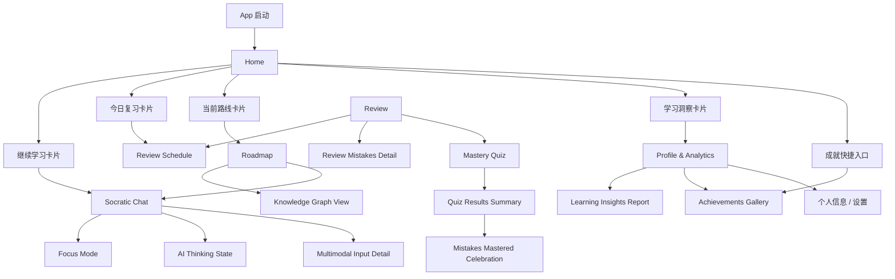

# 智学AI 前端页面结构与开发顺序设计

## 1. 文档目的

本文件用于确认移动端 Flutter 前端的信息架构、页面嵌套关系和建议开发顺序。

当前结论基于以下前提：

- 一级导航采用底部任务栏
- App 默认打开 `Home`
- 当前主结构采用“方案 A：任务流优先”
- 技术架构以 [02-technical-architecture.md](/Users/xia/program/Learn/docs/02-technical-architecture.md) 为准
- 页面来源以当前 Stitch 项目 `AI学习平台前端` 为准

## 2. 一级导航结构

底部任务栏固定为 5 个一级入口：

1. `Home`
2. `Roadmap`
3. `Review`
4. `Socratic Chat`
5. `Profile & Analytics`

定义原则：

- `Home` 是学习总控台，不承担全部功能，但负责分发任务。
- `Socratic Chat` 是核心学习执行页，必须作为一级入口突出。
- `Roadmap` 负责“学什么、学到哪里”。
- `Review` 负责“什么时候复习、复习什么、复习结果如何”。
- `Profile & Analytics` 统一承接个人信息、学习数据、成就和设置相关内容。

## 3. 页面分层与归属

### 3.1 一级页面

| 一级页面 | 页面职责 | 是否底部 Tab |
| --- | --- | --- |
| Home | 今日任务总览、继续学习、快捷分发 | 是 |
| Roadmap | 学习路线、阶段进度、知识点结构 | 是 |
| Review | 复习安排、薄弱点、测验与结果 | 是 |
| Socratic Chat | AI 引导式学习对话主场景 | 是 |
| Profile & Analytics | 用户信息、统计、成就、设置 | 是 |

### 3.2 二级页面与状态页归属

| 页面 | 建议归属 | 页面类型 | 说明 |
| --- | --- | --- | --- |
| Knowledge Graph View | Roadmap | 二级页面 | 从路线页进入，用于查看知识网络结构 |
| Review Schedule | Review | 二级页面 | 从复习页进入，也可从 Home 快捷进入 |
| Review Mistakes Detail | Review | 二级页面 | 查看错题、薄弱点、未掌握知识点 |
| Mastery Quiz | Review | 二级页面 | 对复习或学习完成后的掌握度进行测验 |
| Quiz Results Summary | Review | 二级页面 | 承接测验完成后的结果页 |
| Mistakes Mastered Celebration | Review | 状态页/结果页 | 某类错误被消除后的庆祝反馈 |
| Focus Mode | Socratic Chat | 模式页/状态页 | 学习对话时的专注模式 |
| AI Thinking State | Socratic Chat | 状态页 | AI 思考中态，不视为独立业务页面 |
| Multimodal Input Detail | Socratic Chat | 功能页/面板页 | 多模态输入细节入口，依附对话主流程 |
| Learning Insights Report | Profile & Analytics | 二级页面 | 深度学习报告页 |
| Achievements Gallery | Profile & Analytics | 二级页面 | 成就与徽章总览，Home 可提供快捷入口 |
| New Achievement Notification | Profile & Analytics | 状态页/反馈页 | 获得新成就后的反馈页或弹层 |

### 3.3 非业务主页面

| 页面 | 用途 | 说明 |
| --- | --- | --- |
| Guided Learning Coach 开发路线图 & 页面层级指南 | 设计说明页 | 属于设计文档辅助页面，不属于移动端业务页面 |

## 4. 页面嵌套关系

## 5. 一级页面的推荐内容结构

### 5.1 Home

定位：学习总控台。

建议包含的核心区块：

- 欢迎区与当前学习目标摘要
- 今日学习任务卡
- 今日复习任务卡
- 当前学习路线卡
- 最近一次学习进度摘要
- 学习数据概览卡
- 成就或里程碑卡

从 `Home` 发起的主要跳转：

- `继续学习` -> `Socratic Chat`
- `查看路线` -> `Roadmap`
- `开始复习` -> `Review Schedule`
- `查看分析` -> `Profile & Analytics`
- `查看成就` -> `Achievements Gallery`

### 5.2 Roadmap

定位：学习路径与阶段管理中心。

建议包含的核心区块：

- 当前学习路线总览
- 阶段列表与完成状态
- 当前节点说明
- 里程碑展示
- `知识图谱` 入口

从 `Roadmap` 发起的主要跳转：

- 点击阶段或知识点 -> 进入详情区块或当前页展开
- `开始当前节点学习` -> `Socratic Chat`
- `查看知识图谱` -> `Knowledge Graph View`

### 5.3 Review

定位：复习任务中心。

建议包含的核心区块：

- 今日待复习列表
- 复习日程安排
- 薄弱点/错误高频点
- 复习完成率
- 测验入口

从 `Review` 发起的主要跳转：

- `查看复习安排` -> `Review Schedule`
- `查看错误详情` -> `Review Mistakes Detail`
- `开始掌握度测验` -> `Mastery Quiz`
- 测验完成 -> `Quiz Results Summary`
- 达成修复目标 -> `Mistakes Mastered Celebration`

### 5.4 Socratic Chat

定位：核心学习执行页。

建议包含的核心区块：

- 当前学习主题与知识点标题
- AI 提问对话区
- 用户输入区
- 提示与补讲区
- 学习进度与掌握状态提示

从 `Socratic Chat` 发起的主要跳转或状态切换：

- `专注模式` -> `Focus Mode`
- AI 处理中 -> `AI Thinking State`
- `图片/语音/附件输入` -> `Multimodal Input Detail`
- 当前知识点完成后可返回 `Roadmap` 或转入 `Review`

### 5.5 Profile & Analytics

定位：低频但重要的个人与数据中心。

建议包含的核心区块：

- 用户信息卡
- 学习时长与完成度概览
- 连续学习天数
- 成就与徽章摘要
- 偏好设置与同步状态

从 `Profile & Analytics` 发起的主要跳转：

- `查看完整学习报告` -> `Learning Insights Report`
- `查看全部成就` -> `Achievements Gallery`
- `设置` -> 后续补充专门设置页

## 6. 推荐开发顺序

### Phase 0：应用骨架

优先完成：

1. 全局主题与配色 token
2. 底部任务栏结构
3. 五个一级页面的空壳路由
4. 通用组件基础层

原因：

- 这是所有页面的共同依赖
- 可以尽早验证底部导航、路由和页面切换逻辑

### Phase 1：核心学习主链路

开发顺序：

1. `Home`
2. `Socratic Chat`
3. `Roadmap`

原因：

- `Home -> Socratic Chat -> Roadmap` 构成最核心学习闭环
- 这三页决定产品的主价值是否成立
- 大部分核心 UI 组件会在这三页中被定义和复用

### Phase 2：复习链路

开发顺序：

1. `Review`
2. `Review Schedule`
3. `Review Mistakes Detail`
4. `Mastery Quiz`
5. `Quiz Results Summary`
6. `Mistakes Mastered Celebration`

原因：

- 复习是产品第二主线，但依赖前面的学习数据和路线概念
- 测验与结果页可以在复习页稳定后再补

### Phase 3：个人与数据链路

开发顺序：

1. `Profile & Analytics`
2. `Learning Insights Report`
3. `Achievements Gallery`
4. `New Achievement Notification`

原因：

- 这部分主要是展示和反馈，不阻塞核心学习闭环
- 可在主链路跑通后再补足

### Phase 4：辅助状态与增强能力

开发顺序：

1. `Focus Mode`
2. `AI Thinking State`
3. `Multimodal Input Detail`
4. `Knowledge Graph View`

原因：

- 这些页面更适合作为增强体验或特殊状态
- 其中 `Knowledge Graph View` 虽然业务上重要，但不必早于主路线页面本身

## 7. 建议的 Flutter 路由层级

建议使用如下路由思路：

### 7.1 底部导航容器

- `/home`
- `/roadmap`
- `/review`
- `/chat`
- `/profile`

### 7.2 二级页面

- `/review/schedule`
- `/review/mistakes`
- `/review/quiz`
- `/review/quiz-result`
- `/roadmap/graph`
- `/profile/insights`
- `/profile/achievements`

### 7.3 模式页或状态页

- `/chat/focus`
- `/chat/multimodal`
- `/chat/thinking`
- `/review/mastered`
- `/profile/achievement-notice`

## 8. 当前结论中需要你重点确认的点

请重点核对以下 6 点：

1. `Socratic Chat` 作为一级 Tab，而不是 Home 子页面。
2. `Profile & Analytics` 合并为一个一级 Tab，而不是拆分成两个 Tab。
3. `Review Schedule` 归属于 `Review`，但 `Home` 提供快捷入口。
4. `Knowledge Graph View` 归属于 `Roadmap`，不是独立一级页面。
5. `AI Thinking State`、`Focus Mode`、`Multimodal Input Detail` 视为 `Socratic Chat` 的状态页或功能页。
6. `Achievements Gallery` 主归属 `Profile & Analytics`，`Home` 只保留快捷入口。

## 9. 当前建议的最终结构

如果上述 6 点都成立，则当前移动端页面结构可确定为：

- 五个底部一级页面：`Home / Roadmap / Review / Socratic Chat / Profile & Analytics`
- 主要二级页面：
  - `Knowledge Graph View`
  - `Review Schedule`
  - `Review Mistakes Detail`
  - `Mastery Quiz`
  - `Quiz Results Summary`
  - `Learning Insights Report`
  - `Achievements Gallery`
- 主要状态页：
  - `Focus Mode`
  - `AI Thinking State`
  - `Multimodal Input Detail`
  - `Mistakes Mastered Celebration`
  - `New Achievement Notification`

这个结构适合先做 Flutter 模板化开发，再接后续真实数据与交互状态。
